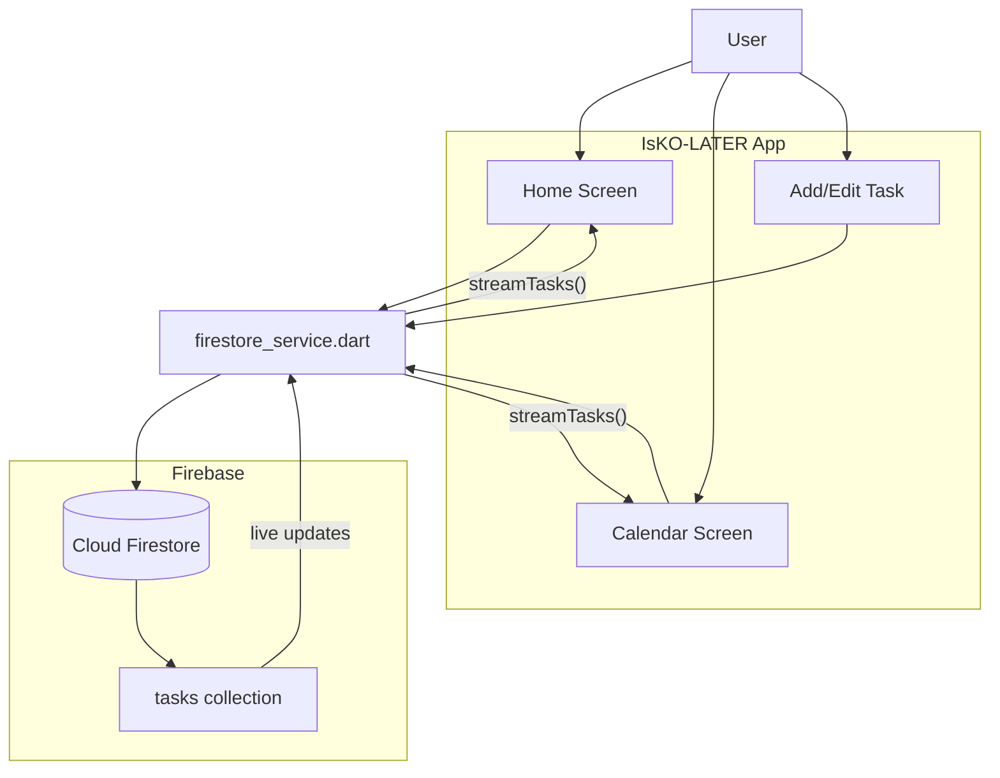
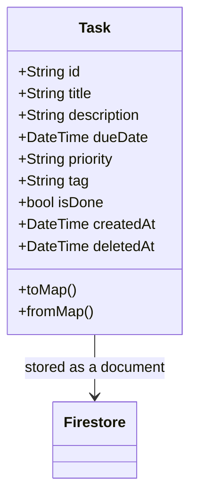
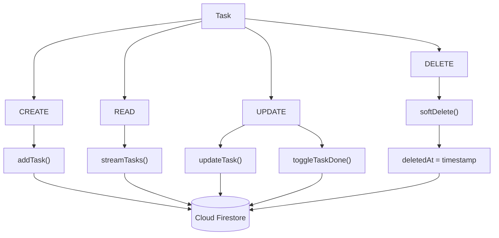
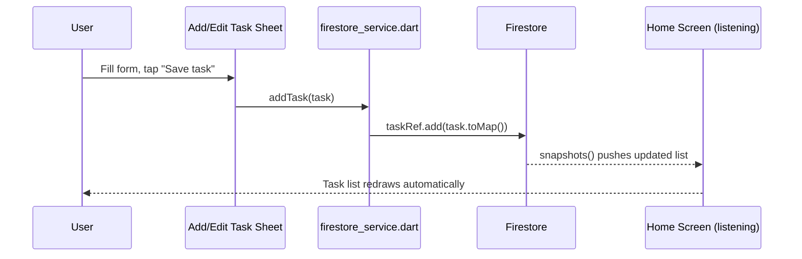
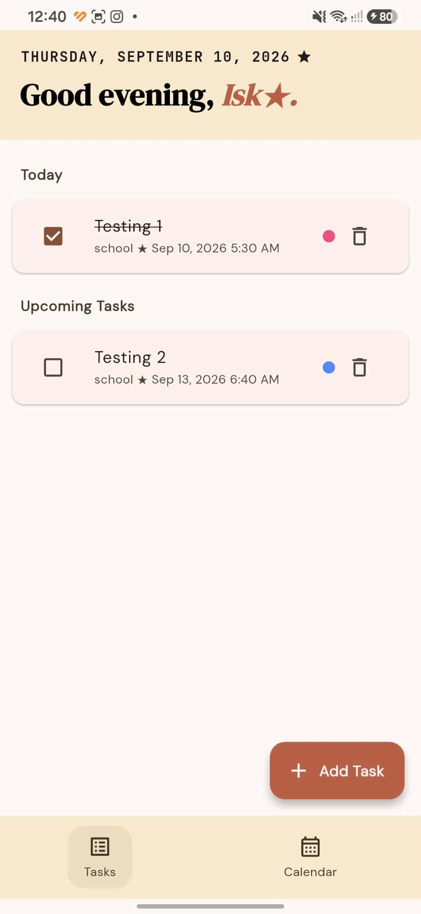
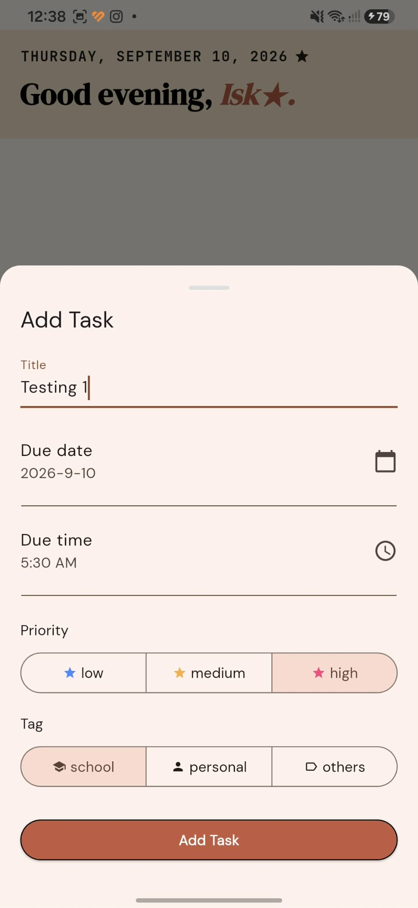
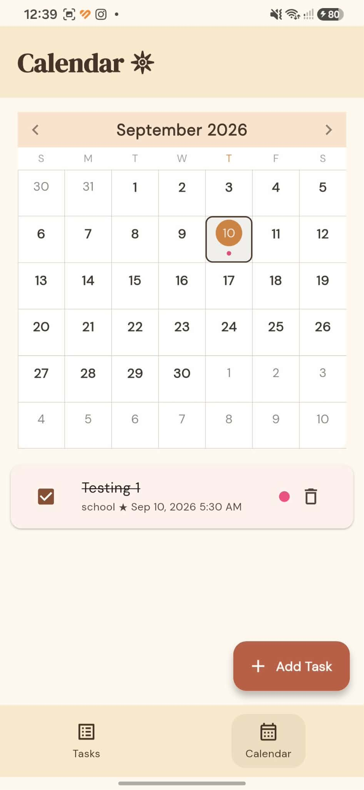

# IsKO-LATER ★
Author: Percie Louise Y. Samaniego
### *For when you're technically an Isko, but proCramming-level procrastinating.*

**BOOGSH K.O. ka later!!**

A simple to-do list app made for students who have **tasks everywhere and somehow still loves cramming**. Add a task, give it a due date and priority, organize it with a tag, check it off when you're finally done, and see everything laid out in a calendar.

Built with **Flutter + Firebase** — because apparently even procrastination needs cloud support.

## Contents
- [Tech Stack & Architecture](#tech-stack--architecture)
- [Local Setup & Installation](#local-setup--installation)
- [Data Operations (CRUD)](#data-operations-crud)
- [Download the App](#download-the-app)
- [Screenshots](#screenshots)

---

## Tech Stack & Architecture

IsKO-LATER keeps the setup relatively simple: **Flutter** handles the app itself, while **Firebase** takes care of storing and syncing the tasks.

- **Flutter (Dart)** — builds the UI and runs on Android/iOS from one codebase.
- **Cloud Firestore** — stores tasks in the cloud. Since Firestore supports *live data streams*, the task list and calendar update automatically whenever a task is added, edited, or checked off — no manual refresh button needed.
- **`syncfusion_flutter_calendar`** — powers the month-view calendar and its per-day task dots.
- **`google_fonts` + `intl`** — used for custom fonts and cleaner date formatting (e.g. `Monday, September 7, 2026`).

### How everything connects

Here's the big picture before we dive into the individual parts:



The important part is that the screens **do not communicate with Firestore directly**. They go through `firestore_service.dart`, which keeps the database logic in one place.

### Task model

A task is the main piece of data moving around the app. Conceptually, it contains the information needed to display, organize, complete, and manage a task:



## Local Setup & Installation

### You'll need

- [Flutter SDK](https://docs.flutter.dev/get-started/install)
- Android Studio or VS Code
- A [Firebase project](https://console.firebase.google.com/)
- Cloud Firestore enabled in your Firebase project

### Setup

```bash
# 1. Clone the repo
git clone https://github.com/perky-boo25/isKO-LATER.git
cd isKO-LATER

# 2. Install packages
flutter pub get

# 3. Connect it to your Firebase project
# This creates firebase_options.dart
dart pub global activate flutterfire_cli
flutterfire configure

# 3. Connect to a simulator or your phone to view

flutter run
```

That's it — pick a device/emulator when prompted and the app should launch.

> **Note:** For local testing, set your Firestore rules to allow read/write. Tighten this before publishing anywhere real:
> ```
> allow read, write: if true;
> ```

---

## Data Operations (CRUD)

All database logic lives in one place: `firestore_service.dart`.

The four basic database operations are **Create, Read, Update, and Delete** — or CRUD, because apparently even a to-do list needs its own acronym.

### CRUD at a glance



### What happens when you save a task?



That's also the reason behind the **instant update, no refresh** behavior.

### Create — add a new task

```dart
Future<void> addTask(Task task) async {
  await _taskRef.add(task.toMap());
}
```

### Read — a live list of tasks

`streamTasks()` listens to Firestore instead of only fetching the tasks once. Whenever the collection changes, the stream provides the updated list.

```dart
Stream<List<Task>> streamTasks() {
  return _taskRef
      .where('deletedAt', isNull: true)
      .orderBy('createdAt', descending: true)
      .snapshots()
      .map((snapshot) => snapshot.docs
          .map((doc) => Task.fromMap(doc.id, doc.data() as Map<String, dynamic>))
          .toList());
}
```

### Update — edit or complete a task

Editing a task updates its existing Firestore document:

```dart
Future<void> updateTask(Task task) async {
  await _taskRef.doc(task.id).update(task.toMap());
}
```

Checking a task off simply switches its `isDone` value:

```dart
Future<void> toggleTaskDone(Task task) async {
  await _taskRef.doc(task.id).update({'isDone': !task.isDone});
}
```

### Delete — hide instead of permanently removing

IsKO-LATER uses a **soft delete**. Instead of completely erasing a task, `softDelete()` adds a `deletedAt` timestamp.

```dart
Future<void> softDelete(Task task) async {
  await _taskRef.doc(task.id).update({'deletedAt': FieldValue.serverTimestamp()});
}
```

The active task stream filters out anything with a `deletedAt` value, so deleted tasks disappear from the normal list while the data is still retained for an **Undo/recovery flow**.

---

## Download the App

📱 [**Get the installable app here**](https://drive.google.com/file/d/1A5L-Vb8Tzh9SS9rfBxjSLjtxlF1Nu9F2/view?usp=drive_link)

**NOTE: This is made for android only and download at your own risk.**

*(Android may ask you to allow "install from unknown sources" — that's expected for an APK shared outside the Play Store.)*

---

## Screenshots

### Home Screen =(Task List)



### Add/Edit Modal



### Calendar view



---

### Made for the Iskos who said:

> *"I'll do it later."*

…pero ma K-K.O LATER dahil sa burnt out.
